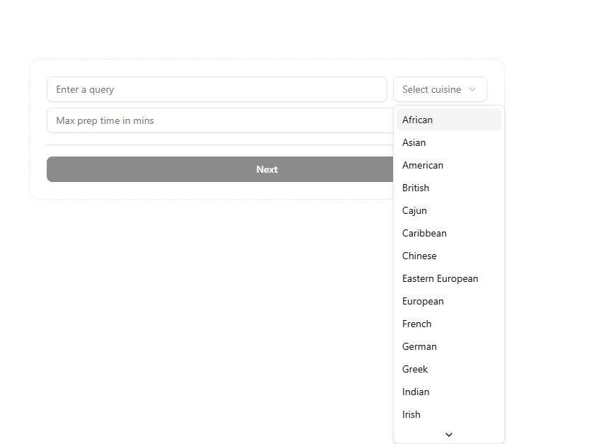
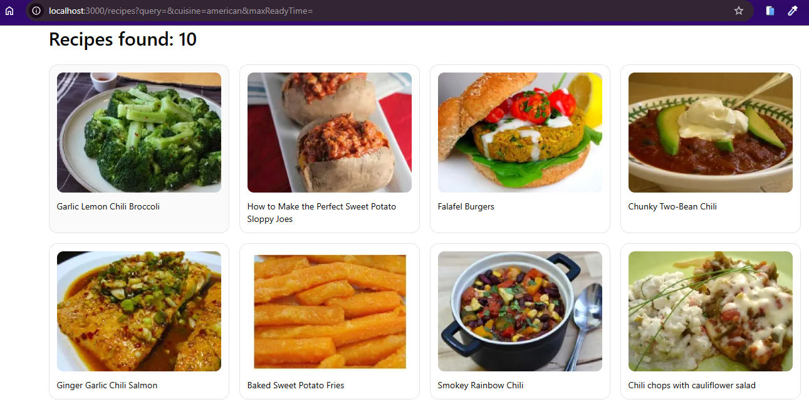
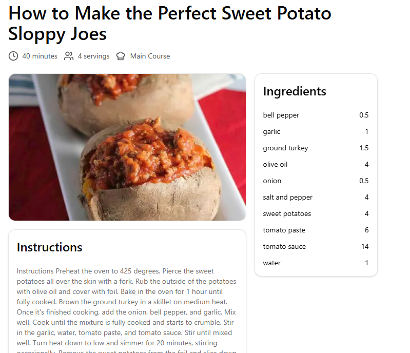

# recipe-finder app

Built with [Next.js](https://nextjs.org), [TypeScript](https://www.typescriptlang.org/),
and [TailwindCSS](https://tailwindcss.com/)

## Getting Started

First, run the development server:

```bash
npm run dev
# or
yarn dev
# or
pnpm dev
# or
bun dev
```

Open [http://localhost:3000](http://localhost:3000) with your browser to see the result.

## Pages

### Home page



When you open the app, you will see a form with a couple of options:

- An input field for the query
- A select field for the cuisine
- An input field for the preparation time
- A button to submit the form

The form, once submitted, will redirect you to a page with the results. You have to fill at least one of the fields to
proceed.

### Recipes page



On the recipes page, you will see a list of recipes you searched for.

By default (if no search query is provided), the page will show all the recipes.
You will see at max 10 recipes on the screen (default api behavior).

You can click on a recipe to be redirected to the recipe page.

### Recipe page



On the recipe page, you will see the recipe details. The recipe details are fetched from the api by `id`.